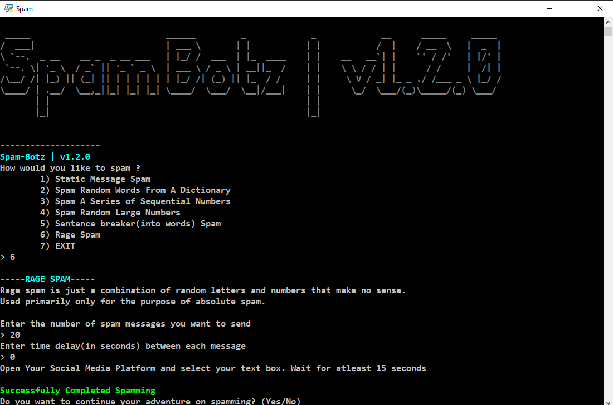

# Spam-Bot

    
     A simple and easy to use Spam Bot

---

## This application allows you to spam in variations, like : 
- Spamming a fixed static message.
- Spamming random words from a dictionary.
- Sending sequences of numbers.
- Randomly spamming large numbers.
- Breaking a sentence into its component words and spam them as seperate messages.
- Good old Rage spam, but this time without breaking your keyboard.

## Usage

    

Run `Spam_botz.py` file present in the `src` folder.

**NOTE :** It is best to open your messaging window before launching `Spam_botz.py`.

**NOTE :** Make sure your cursor is pointing to the correct text box after you set your preferences.
You have only **15 Seconds** before the automation process begins.

Sometimes you might get banned from the server for spamming too many messages in a short period. To avoid this,
This application has a custom time delay feature. Make sure you enter the appropriate value.
