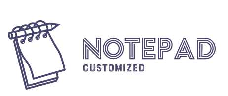

# Custom-notepad

    
     A Customised version of window's notepad with additional features.

---

## Motivation

    

The primary motivation for building a custom notepad was mainly due to the lack of features on the default one. 
The only use of the default notepad is to take down quick notes. There are no other formatting features.  
It is outdated and hence I set out to build my own custom version of the notepad with loaded features, including the dark mode.

## Usage

Custom notepad uses a custom font of Agency FB. Most windows computers have them preinstalled. However, if you don't, just open the **assets** folder and launch the `agency-fb.ttf` file and click on install.

Once you have the source code downloaded, launch the `Notepad.py` file present in the `src` folder.
You can also create a shortcut of the `Notepad.py` file and move it to any place desired.

**Note** : You can move the shortcut file to `C:\Users\Username` folder to launch it directly from your console or your Run dialog box.  
However, make sure you change the name of the shortcut file to something other than notepad. 

If you do the above step, you can then launch the Custom notepad by directly typing `Filename.lnk` on your Terminal or by just typing `Filename.py` on your Run dialog box, where Filename is the name of the shortcut file.

You can use Custom-notepad just like your default windows preinstalled notepad. But the usage of the different new features are mentioned below : 

- You can insert current Date, Time or both by going to the `Insert` menu and selecting the required option.
- You can make your font **Bold**(Ctrl + B) or *Italic*(Ctrl + Y) by selecting the text you want to format and then choosing the desired format type From the format menu.
- You can also `Underline`(Ctrl + U) or `Highlight`(Ctrl + H) selected text from the format menu.
- To remove formats just select the text and click on the `Remove Format`(Ctrl + Q) option under the format menu.

- There is also a `Search With Google`(Ctrl + E) feature under the edit menu that allows you to search the selected text in google. Just select the text and then click on the search with google option. If no text is selected, it automatically opens google.com.

- Do you have the problem of exiting the application without saving? Well, don't worry. Custom-notepad's got your back! Everytime you close the application, your current progress (content) is **`automatically`** saved.

- You can continue where you left off when you relaunch the application. Saves you a lot of time.

Custom-notepad offers a variety of personalization features for your notepad.
- You can change your font colour by clicking on `Text Colour`(Ctrl + F) option under the Personalize menu.
- You can also change the background colour to your own desired colour.
- The main key feature of the Custom-notepad is that it allows you to turn on **Dark mode**(Alt + D). To toggle Dark mode on and off, just click on the dark mode option under the personalize menu. 

    
     Notepad with dark mode enabled

- There is also a `Journal mode`(Alt + J) that adds current date and time to every entry you create and everytime you open the file. To toggle Journal mode on and off, just click on Journal mode in the personalize menu.

- Personalization changes made are saved. That is, everytime you launch the Notepad, it continues where you left off (Modes remain enabled or disabled based on choices).

- There are additional keyboard shortcuts as well. Just click on the menu and you can see keyboard shortcuts available for each of the functions.

If you have any other queries regarding the product, click on the `Send Feedback` option under the help menu and create an Issue. We will get back to you as soon as possible. 