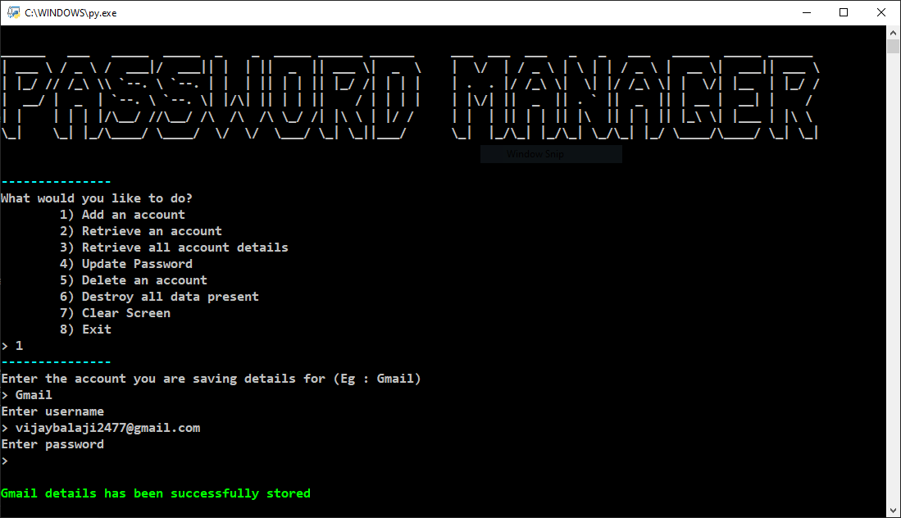

# Password-Manager

    
     A simple application built to keep your passwords safe and collected.

---

## Motivation

As the number of accounts created increases, it has become harder to collect and save all the passwords safely in one location. And hence I built this python application to create a database that keeps track of all your account usernames and passwords.

**Note** : Password manager only stores your data. It does not secure them.

## Usage

    

**Prerequisites** : Python 3 and Cryptography module.

Before running the application, you need to install the [cryptography](https://pypi.org/project/cryptography/) module. To do so, launch your terminal and type `pip install cryptography`. Once completed, you are ready to use the application.

Run the `Password_manager.py` file present in the `src` folder.

You can do that by just double clicking on the file if you have the python launcher installed. Else, `cd/` to the `src` folder and type `python Password_manager.py`.

Once you have it running, follow the instructions given by the application.

You can use this along with the Safe Haven application for added security measures.